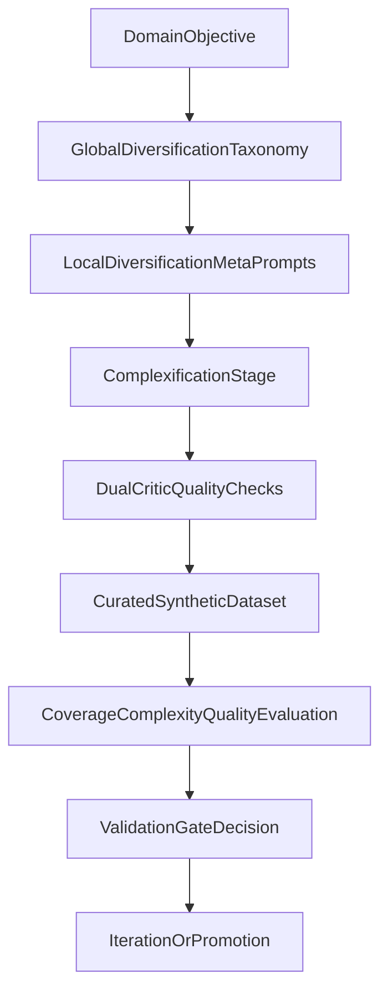

# Simula Research Validation

This repository is for validating a Simula-style synthetic data framework before production integration. The goal is to reproduce the core mechanism-design ideas from the Simula research line: treat dataset construction as a controllable system across independent axes of coverage, complexity, and quality.

## Scope

This phase is research-first and validation-focused.

- Build and evaluate the generation mechanism, not a full production platform.
- Verify that decomposition into independent control axes produces measurable gains.
- Establish reproducible experimentation and decision gates for promotion.

## System overview

The validation pipeline is designed around four generation stages and one evaluation stage:

1. **Global diversification**: build hierarchical taxonomies to map domain coverage.
2. **Local diversification**: produce diverse instantiations within each taxonomy concept.
3. **Complexification**: raise difficulty for a controlled fraction of samples.
4. **Dual-critic quality checks**: independently verify correctness and reject low-quality samples.
5. **Evaluation**: compute coverage, complexity calibration, and quality metrics for run decisions.

## Documentation map

Use the structured docs index first:

- [`docs/README.md`](docs/README.md)

Domain language anchors:

- [`contexts/core/CONTEXT.md`](contexts/core/CONTEXT.md)
- [`contexts/eval/CONTEXT.md`](contexts/eval/CONTEXT.md)
- [`CONTEXT-MAP.md`](CONTEXT-MAP.md)

## First validation quickstart

The exact scripts and commands will be added as code lands. Use this staged flow for the first end-to-end validation cycle:

1. Define target domain and taxonomy depth/branching policy.
2. Generate taxonomy and inspect node coverage map.
3. Generate local instantiations from taxonomy nodes.
4. Apply complexification policy to the configured sample fraction.
5. Run dual-critic checks and regenerate rejected samples.
6. Compute evaluation metrics and compare against baseline/ablations.
7. Fill run report template and decide: iterate or promote.

## Definition of done for initial validation

Initial validation is complete when all of the following are true:

- Coverage, complexity, and quality are each measurable with explicit metrics.
- At least one full baseline and one ablation matrix are executed and reported.
- Run artifacts are reproducible from stored config, seed, and model metadata.
- A validation gate decision is made with documented evidence and trade-offs.

## Source guide

The primary research reference for this repository is:

- [`docs/research_paper.pdf`](docs/research_paper.pdf)
