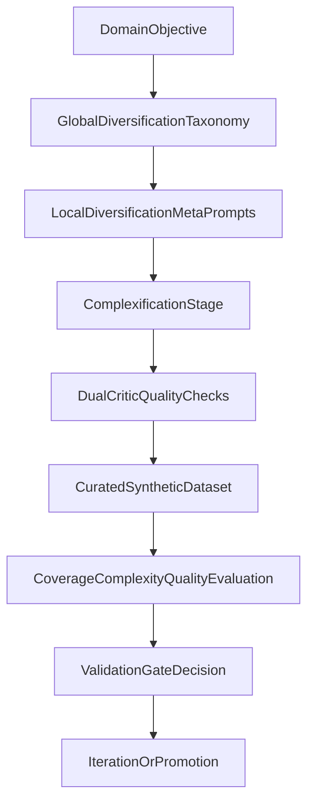

# Simula Research Validation

This repository is for validating a Simula-style synthetic data framework before production integration. The goal is to reproduce the core mechanism-design ideas from the Simula research line: treat dataset construction as a controllable system across independent axes of coverage, complexity, and quality.

## Scope

This phase is research-first and validation-focused.

- Build and evaluate the generation mechanism, not a full production platform.
- Verify that decomposition into independent control axes produces measurable gains.
- Establish reproducible experimentation and decision gates for promotion.

## System overview

The validation pipeline is designed around four generation stages and one evaluation stage:

1. **Global diversification**: build hierarchical taxonomies to map domain coverage.
2. **Local diversification**: produce diverse instantiations within each taxonomy concept.
3. **Complexification**: raise difficulty for a controlled fraction of samples.
4. **Dual-critic quality checks**: independently verify correctness and reject low-quality samples.
5. **Evaluation**: compute coverage, complexity calibration, and quality metrics for run decisions.


```mermaid
flowchart TD
  domainObjective[DomainObjective] --> globalDiversification[GlobalDiversificationTaxonomy]
  globalDiversification --> localDiversification[LocalDiversificationMetaPrompts]
  localDiversification --> complexification[ComplexificationStage]
  complexification --> dualCritic[DualCriticQualityChecks]
  dualCritic --> curatedDataset[CuratedSyntheticDataset]
  curatedDataset --> metricsEval[CoverageComplexityQualityEvaluation]
  metricsEval --> validationDecision[ValidationGateDecision]
  validationDecision --> iterationLoop[IterationOrPromotion]
```

## Documentation map

Use the structured docs index first:

- [`docs/README.md`](docs/README.md)

Domain language anchors:

- [`contexts/core/CONTEXT.md`](contexts/core/CONTEXT.md)
- [`contexts/eval/CONTEXT.md`](contexts/eval/CONTEXT.md)
- [`CONTEXT-MAP.md`](CONTEXT-MAP.md)

## First validation quickstart

From the repository root, run the full Issue 7 B0/A1/A2/A3/A4/A5 matrix with the native
Python runner:

```powershell
$env:PYTHONPATH = "src"
$env:SIMULA_CRITIC_BACKEND = "stub"  # use "nim" for live critics
py -3 -m simula_research.cli matrix
```

For rate-limited providers, run an opt-in smaller matrix while preserving the
same six-cell ablation semantics:

```powershell
py -3 -m simula_research.cli matrix --per-node-instantiations 1
```

The Bash wrapper accepts the equivalent `SIMULA_MATRIX_PER_NODE_INSTANTIATIONS=1`
environment variable.

After downloading benchmark files separately, build a local hash/count manifest
without adding the data to this repository:

```powershell
py -3 -m simula_research.cli verify-datasets `
  --dataset-path CTI-MCQ=C:\data\cti-mcq.tsv `
  --dataset-path CTI-RCM=C:\data\cti-rcm.tsv `
  --dataset-path GSM8k=C:\data\gsm8k.jsonl `
  --dataset-path LEXam=C:\data\lexam.parquet `
  --dataset-path Global-MMLU=C:\data\global-mmlu.parquet `
  --observed-count LEXam=1655 `
  --observed-count Global-MMLU=14042 `
  --output artifacts\datasets\local_manifest.json
```

The command uses `configs/paper_dataset_splits.json` by default, records each
file's SHA-256 and observed count, and exits with status `2` when any count
does not match the pinned manifest.

For supported TSV/JSONL benchmarks, score a model's task-id prediction
artifact without installing a model runtime:

```powershell
py -3 -m simula_research.cli score-benchmark `
  --dataset-id CTI-MCQ `
  --dataset-path C:\data\cti-mcq.tsv `
  --predictions C:\data\cti-mcq-predictions.json `
  --dataset-size 2500 `
  --seed 0 `
  --output artifacts\datasets\cti-mcq-result.json
```

Prediction JSON may be either a task-ID mapping or a list of
`{"task_id": "...", "prediction": "..."}` objects. The scorer currently
supports CTI-MCQ, CTI-RCM, and GSM8k; parquet-backed benchmarks still require
an optional reader.

The existing `scripts/run_issue7_matrix.sh` wrapper is equivalent for Bash
environments. The staged flow for the first end-to-end validation cycle is:

1. Define target domain and taxonomy depth/branching policy.
2. Generate taxonomy and inspect node coverage map.
3. Generate local instantiations from taxonomy nodes.
4. Apply complexification policy to the configured sample fraction.
5. Run dual-critic checks and regenerate rejected samples.
6. Compute evaluation metrics and compare against baseline/ablations.
7. Fill run report template and decide: iterate or promote.

## Definition of done for initial validation

Initial validation is complete when all of the following are true:

- Coverage, complexity, and quality are each measurable with explicit metrics.
- At least one full baseline and one ablation matrix are executed and reported.
- Run artifacts are reproducible from stored config, seed, and model metadata.
- A validation gate decision is made with documented evidence and trade-offs.

## Source guide

The primary research reference for this repository is:

- [`docs/research_paper.pdf`](docs/research_paper.pdf)
