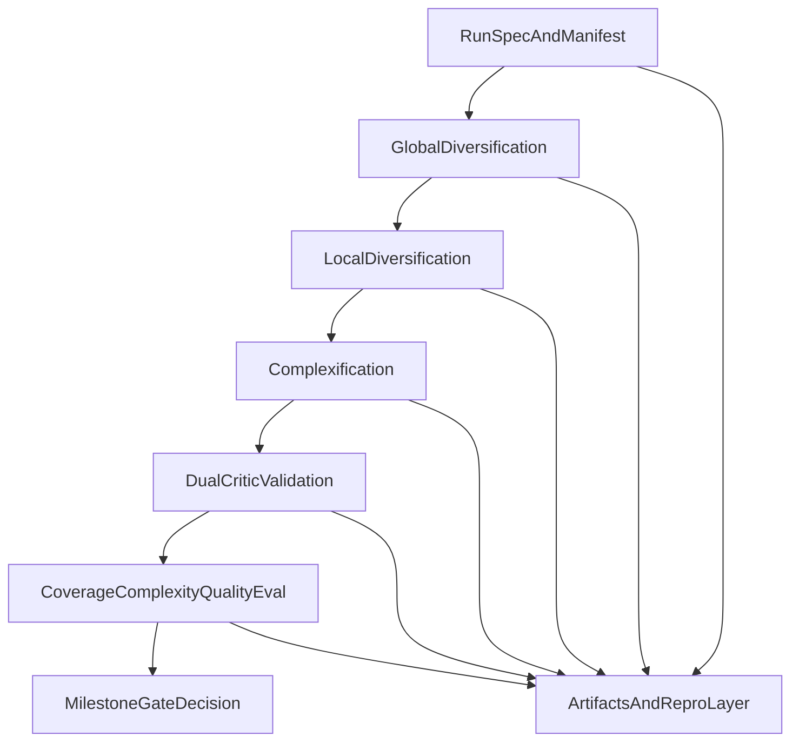

# Simula Implementation Plan

## Purpose

This document defines a paper-aligned implementation roadmap for the first engineering cycle of Simula in this repository. The immediate objective is not platformization; it is reproducing validation signals on one pilot domain with strong experiment discipline.

## Success target for this plan

The first implementation cycle succeeds when we can run a full baseline plus targeted ablations and produce a defensible milestone gate decision using:

- coverage metrics
- calibrated complexity metrics
- dual-critic quality metrics
- reproducibility evidence

## Principles

- Keep coverage, complexity, and quality as independent control axes.
- Build thin, runnable vertical slices before broad abstraction.
- Preserve comparability across baseline and ablation runs.
- Treat reproducibility metadata as a hard requirement, not an afterthought.

## Architecture modules (first-pass)

### 1) RunSpec and configuration layer

Responsibility:

- parse and validate run config
- freeze seed/model/protocol metadata
- produce a canonical `run_id`

Key outputs:

- immutable run spec
- manifest skeleton

### 2) Taxonomy engine (global diversification)

Responsibility:

- generate and refine taxonomy graph
- enforce acyclic, stable node contracts

Key outputs:

- taxonomy graph
- per-node metadata

### 3) Local diversification engine

Responsibility:

- derive meta-prompts from taxonomy nodes
- generate multiple instantiations per node
- enforce anti-collapse constraints

Key outputs:

- candidate sample set with lineage (`taxonomy_node_id`, `meta_prompt_id`)

### 4) Complexification engine

Responsibility:

- apply controlled difficulty transforms
- preserve semantic target and coverage assignment

Key outputs:

- mixed-difficulty candidate set with complexity tags

### 5) Dual-critic quality engine

Responsibility:

- independent critic scoring
- adjudication and regeneration logic
- disagreement and rejection logging

Key outputs:

- curated dataset
- quality decision logs

### 6) Evaluation engine

Responsibility:

- compute coverage, complexity, and quality metrics
- generate gate-oriented run report

Key outputs:

- metrics artifacts
- baseline/ablation comparison tables

### 7) Reproducibility and artifacts layer

Responsibility:

- persist stage artifacts by convention
- persist complete run manifest
- support deterministic rerun checks

Key outputs:

- auditable artifact tree
- replay report

## Milestone roadmap

### Milestone 1: Reproduce paper-like validation signals on one pilot domain

Scope:

- implement minimally runnable versions of all six core stages
- execute `B0` (full pipeline) plus at least `A1` and `A4` from playbook
- produce gate decision report tied to metrics spec

Exit criteria:

- stage outputs are fully traceable
- required thresholds are computed and reported
- at least one baseline-vs-ablation contrast is interpretable

### Milestone 2: Stabilize reproducibility and experiment operations

Scope:

- enforce manifest schema and artifact directory conventions
- run deterministic rerun protocol on baseline
- document drift handling for non-deterministic provider behavior

Exit criteria:

- rerun check completed and recorded
- comparability protocol frozen for the active pilot objective

### Milestone 3: Extract reusable engine seams

Scope:

- introduce provider/model interfaces
- isolate stage boundaries for reuse
- keep milestone-1 metrics behavior intact

Exit criteria:

- stage contracts preserved under interface extraction
- no loss in baseline comparability semantics

## Dependency map

## Pilot-domain path

1. Choose one domain objective and freeze task format.
2. Tune taxonomy depth/branching for manageable first-run budget.
3. Execute full pipeline baseline (`B0`).
4. Execute ablations (`A1`, `A4`) for signal contrast.
5. Diagnose axis-level failures and perform one-parameter retries.
6. Record milestone gate decision and risks for next milestone.

## Risks and mitigations

- **Weak ablation signal**: tighten protocol comparability and increase sample budget for contrast.
- **Critic disagreement spikes**: inspect disagreement logs by taxonomy segment before threshold edits.
- **Over-complexification drift**: enforce semantic-preservation checks before critic stage.
- **Reproducibility gaps**: block promotion until manifest and rerun criteria are met.

## References

- [`README.md`](../README.md)
- [`docs/pipeline-spec.md`](./pipeline-spec.md)
- [`docs/evaluation-metrics.md`](./evaluation-metrics.md)
- [`docs/research-validation-playbook.md`](./research-validation-playbook.md)
- [`docs/reproducibility-ops.md`](./reproducibility-ops.md)
