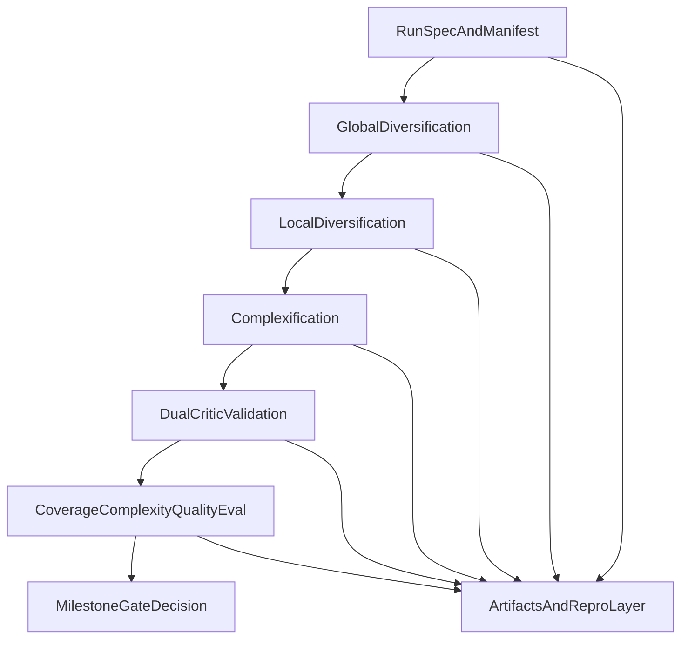

# Simula Implementation Plan

## Purpose

This document defines a paper-aligned implementation roadmap for the first engineering cycle of Simula in this repository. The immediate objective is not platformization; it is reproducing validation signals on one pilot domain with strong experiment discipline.

## Success target for this plan

The first implementation cycle succeeds when we can run a full baseline plus targeted ablations and produce a defensible milestone gate decision using:

- coverage metrics
- calibrated complexity metrics
- dual-critic quality metrics
- reproducibility evidence

## Principles

- Keep coverage, complexity, and quality as independent control axes.
- Build thin, runnable vertical slices before broad abstraction.
- Preserve comparability across baseline and ablation runs.
- Treat reproducibility metadata as a hard requirement, not an afterthought.

## Architecture modules (first-pass)

### 1) RunSpec and configuration layer

Responsibility:

- parse and validate run config
- freeze seed/model/protocol metadata
- produce a canonical `run_id`

Key outputs:

- immutable run spec
- manifest skeleton

### 2) Taxonomy engine (global diversification)

Responsibility:

- generate and refine taxonomy graph
- enforce acyclic, stable node contracts

Key outputs:

- taxonomy graph
- per-node metadata

### 3) Local diversification engine

Responsibility:

- derive meta-prompts from taxonomy nodes
- generate multiple instantiations per node
- enforce anti-collapse constraints

Key outputs:

- candidate sample set with lineage (`taxonomy_node_id`, `meta_prompt_id`)

### 4) Complexification engine

Responsibility:

- apply controlled difficulty transforms
- preserve semantic target and coverage assignment

Key outputs:

- mixed-difficulty candidate set with complexity tags

### 5) Dual-critic quality engine

Responsibility:

- independent critic scoring
- adjudication and regeneration logic
- disagreement and rejection logging

Key outputs:

- curated dataset
- quality decision logs

### 6) Evaluation engine

Responsibility:

- compute coverage, complexity, and quality metrics
- generate gate-oriented run report

Key outputs:

- metrics artifacts
- baseline/ablation comparison tables

### 7) Reproducibility and artifacts layer

Responsibility:

- persist stage artifacts by convention
- persist complete run manifest
- support deterministic rerun checks

Key outputs:

- auditable artifact tree
- replay report

## Milestone roadmap

### Milestone 1: Reproduce paper-like validation signals on one pilot domain

Scope:

- implement minimally runnable versions of all six core stages
- execute `B0` (full pipeline) plus at least `A1` and `A4` from playbook
- produce gate decision report tied to metrics spec

Exit criteria:

- stage outputs are fully traceable
- required thresholds are computed and reported
- at least one baseline-vs-ablation contrast is interpretable

### Milestone 2: Stabilize reproducibility and experiment operations

Scope:

- enforce manifest schema and artifact directory conventions
- run deterministic rerun protocol on baseline
- document drift handling for non-deterministic provider behavior

Exit criteria:

- rerun check completed and recorded
- comparability protocol frozen for the active pilot objective

### Milestone 3: Extract reusable engine seams

Scope:

- introduce provider/model interfaces
- isolate stage boundaries for reuse
- keep milestone-1 metrics behavior intact

Exit criteria:

- stage contracts preserved under interface extraction
- no loss in baseline comparability semantics

## Current engineering status (live)

**Last reviewed:** 2026-05-26 — `main` @ `0885feb`, `docs/agents/next-agent-handoff.md`.

### Completion verdict

| Track | Status |
| --- | --- |
| **Implementation (Milestones 1–3 + ADR 0004 Option A + P1 #60–#61)** | **Complete** |
| **Deterministic validation (unittest + Issue #7/#9 evidence)** | **Complete** |
| **Provider-backed validation (LLM Phase 4)** | **Optional post-completion track** — human credentials / org policy only |
| **Issue #62 (engine-core refactor, Option B)** | **Closed — wontfix / deferred** |

| Milestone | Status | Notes |
| --- | --- | --- |
| **Milestone 1** | **Met** | Runnable stages + B0/A1/A4 + gate reporting. Canonical packet `artifacts/reports/issue7/20260526T025931Z/` (PRs **#69**, **#70**, **#76**): **B0/A1/A4 pass**. |
| **Milestone 1 (HITL)** | **Signed conditional_pass** | April review **fail** on legacy packet `20260430T204744Z` (preserved). Addendum `20260526T025931Z` signed `project-owner-delegated`. |
| **Milestone 2** | **Met** | Manifest schema validation, baseline rerun classification (`artifacts/reports/issue9/`, PR #25). |
| **Milestone 3 (seams)** | **Met** | Stage contracts (#27), `RunArtifactStore` (#28), critic hooks (#29), comparability gate (#30). |
| **Post–M3 hardening** | **Met** | TypedDict handoff types (#31 / PR #32); artifact tree `40_dual_critic_quality` (#33 / PR #34). |
| **ADR 0004 P1 follow-ons** | **Closed** | **#60**, **#61**; **#62** deferred closed. |
| **Issue #10 / ADR 0004** | **Closed** | Option A minimal seams. |
| **LLM readiness Phases 0–3** | **Met** | Seams + deterministic Stages 1–3 + execution fidelity. |
| **LLM readiness Phase 4** | **Optional post-completion** | Live provider matrix — see `docs/llm-validation-readiness.md`. |
| **First implementation cycle** | **Complete** | Engineering + deterministic validation complete on `main`. |

### Optional post-completion (no agent engineering required)

1. **NIM / org policy (Phase 4)** — API keys and budget guardrails before optional provider-backed B0/A1/A4 runs.

Playbook promotion (H1–H4, ≥2 baseline stability) is **post–Phase 4** research ops, not a blocker for implementation closure.

### Testing prerequisites

- **Python 3.11+**; **98 tests** green on `main` via `PYTHONPATH=src python3 -m unittest discover -s tests -v`.  
- **No API keys** for unittest. Live NIM critic runs require `NVIDIA_API_KEY` / `NVAPI_KEY` per `docs/llm-validation-readiness.md`.

## Dependency map

```mermaid
flowchart TD
  runSpec[RunSpecAndManifest] --> taxonomyStage[GlobalDiversification]
  taxonomyStage --> localStage[LocalDiversification]
  localStage --> complexityStage[Complexification]
  complexityStage --> criticStage[DualCriticValidation]
  criticStage --> evalStage[CoverageComplexityQualityEval]
  evalStage --> gateDecision[MilestoneGateDecision]
  runSpec --> artifactsLayer[ArtifactsAndReproLayer]
  taxonomyStage --> artifactsLayer
  localStage --> artifactsLayer
  complexityStage --> artifactsLayer
  criticStage --> artifactsLayer
  evalStage --> artifactsLayer
```

## Pilot-domain path

1. Choose one domain objective and freeze task format.
2. Tune taxonomy depth/branching for manageable first-run budget.
3. Execute full pipeline baseline (`B0`).
4. Execute ablations (`A1`, `A4`) for signal contrast.
5. Diagnose axis-level failures and perform one-parameter retries.
6. Record milestone gate decision and risks for next milestone.

## Risks and mitigations

- **Weak ablation signal**: tighten protocol comparability and increase sample budget for contrast.
- **Critic disagreement spikes**: inspect disagreement logs by taxonomy segment before threshold edits.
- **Over-complexification drift**: enforce semantic-preservation checks before critic stage.
- **Reproducibility gaps**: block promotion until manifest and rerun criteria are met.

## References

- [`README.md`](../README.md)
- [`docs/pipeline-spec.md`](./pipeline-spec.md)
- [`docs/evaluation-metrics.md`](./evaluation-metrics.md)
- [`docs/research-validation-playbook.md`](./research-validation-playbook.md)
- [`docs/reproducibility-ops.md`](./reproducibility-ops.md)
- [`docs/issues-draft.md`](./issues-draft.md)
- [`docs/parallel-agent-prompts.md`](./parallel-agent-prompts.md)
